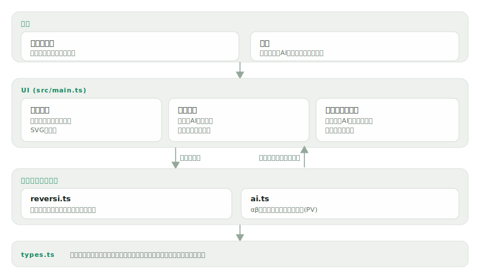

# ishigaeshi

[](https://github.com/miruky/ishigaeshi/actions/workflows/ci.yml)
[](https://github.com/miruky/ishigaeshi/actions/workflows/deploy.yml)
[](https://www.typescriptlang.org/)
[](LICENSE)

**ブラウザで遊ぶリバーシ(オセロ)。対局しながら、AIが今の局面をどう評価し、どんな手順を読んでいるかを盤上に重ねて見られる**

デモ: https://miruky.github.io/ishigaeshi/

## 概要

ishigaeshiは、AIと対局するリバーシに、AIの「読み」を可視化する機能を足したものである。盤の空きマスに出るヒントをクリックするか、矢印キーで選んでEnterを押すと石を打て、挟んだ相手の石が返り、AIが応じる。横のパネルにはAIが付けた評価値と、AIが最善と見ている手順(読み筋)が並び、その先頭の数手は盤の上にも番号付きで重ねて表示される。今の局面が黒・白どちらに傾いているか、なぜその手が良いのかを、対局しながら確かめられる。

盤の下には黒から見た形勢の推移が折れ線で出る。指した手は棋譜として残り、各手をクリックすればその局面に戻って検討でき、「待った」「進む」で局面を行き来できる。対局の状態はURLに保存されるので、共有リンクを開けば同じ盤面から再開・検討ができる。設定(自分の石・AIの強さ・読み筋表示・テーマ)はブラウザに保存する。

AIはアルファベータ法で数手先まで読む。評価は、隅やその周辺といったマスの価値、打てる手の多さ(機動力)、石数の差を、終盤ほど石数を重く見るように合成して決める。乱数を使わないので、同じ局面からは必ず同じ手を選ぶ。強さは読みの深さで3段階に切り替えられる。

リバーシのルールはブラウザ内で完結して実装している。8方向の挟みによる裏返し、打てないときのパス、両者が打てなくなったときの終局までを扱い、盤・石・ヒント・読み筋はすべてSVGで描く。

### なぜ作ったのか

リバーシは「今の形が良いのか悪いのか」が初心者には分かりにくい。AIに勝てないとき、相手が何を見て指しているのかが見えれば、隅の価値や悪いマスを避ける感覚が掴める。そこで、対局相手のAIに評価値と読み筋を語らせ、それを盤に重ねて示すことにした。実装としては、ルールと探索を描画から切り離し、評価関数や合法手生成を単体でテストできる形にしている。

## アーキテクチャ



## 技術スタック

| カテゴリ             | 技術                                 |
| :------------------- | :----------------------------------- |
| 言語                 | TypeScript 5(strict、実行時依存ゼロ) |
| 探索                 | アルファベータ法(ネガマックス)       |
| 描画                 | インラインSVG(DOM操作)               |
| ビルド               | Vite 8                               |
| テスト               | Vitest 4(node / jsdom)              |
| リンタ・フォーマッタ | ESLint(typescript-eslint)+ Prettier  |
| CI / 配信            | GitHub Actions / GitHub Pages        |

## 使い方

1. 「あなたの石」で先手(黒)か後手(白)を選び、「新規対局」を押す。
2. 盤に出る半透明のヒントをクリックするか、矢印キーで選んでEnterを押し、石を置く。挟んだ相手の石が返る。
3. 右の「評価」に評価値と読み筋が出る。読み筋の先頭の数手は盤上に番号で重なる。盤の下に黒から見た形勢の推移が描かれる。
4. 打つ手がなければ自動でパス。両者打てなくなったら石数の多い方が勝ち。
5. 棋譜の各手をクリックするとその局面に戻って検討できる。「URLを共有」で今の対局のリンクをコピーできる。

| 操作         | 内容                                          |
| :----------- | :-------------------------------------------- |
| 石を置く     | 盤のヒントをクリック、または矢印キー+Enter    |
| AIの強さ     | やさしい / ふつう / つよい(読みの深さ)        |
| あなたの石   | 黒(先手)か白(後手)を選ぶ                      |
| 待った / 進む | 自分の着手を1手戻す / 戻した手をやり直す      |
| ヒント       | 今の局面での自分の最善手を盤に示す            |
| 読み筋を表示 | AIの予想手順を盤に重ねる表示の切り替え        |
| 棋譜をクリック | その手数の局面に戻って検討する              |
| URLを共有    | 今の対局を載せたリンクをコピーする            |
| 棋譜をコピー | 着手の一覧をテキストでコピーする              |

キーボードでは u=待った、r=進む、h=ヒント、n=新規対局も使える。評価値は黒から見た値で示し、正なら黒有利、負なら白有利、終盤で勝敗が確定すると「勝勢」と表示する。

### エンジンを使う

ルールとAIは描画から独立している。盤を作って合法手や裏返しを計算したり、最善手・評価値・読み筋を求められる。

```ts
import { initialBoard, legalMoves, applyMove, analyze } from './src/lib';

const board = initialBoard();
legalMoves(board, 'black'); //=> 4手([2,3] [3,2] [4,5] [5,4])

const a = analyze(board, 'black', 6); // 6手読みで解析
a.move; //=> 最善手
a.score; //=> 黒から見た評価値
a.pv; //=> 読み筋(最善応手の連なり)

const next = applyMove(board, a.move!, 'black'); // 着手後の新しい盤
```

`analyze` は乱数を使わないため、同じ盤・同じ深さからは常に同じ結果を返す。

## プロジェクト構成

- `src/lib/types.ts` 盤・石・着手・解析結果の型
- `src/lib/reversi.ts` 合法手生成・裏返し・パス・終局・石数
- `src/lib/ai.ts` 評価関数とアルファベータ探索、読み筋の生成
- `src/lib/record.ts` 棋譜の符号化・復号・再生(共有URLと検討の基盤)
- `src/main.ts` SVG盤の描画・対局進行・読み筋と形勢グラフ・棋譜の可視化
- `src/style.css` 配色とタイポグラフィ、レイアウト
- `docs/` アーキテクチャ図

## はじめ方

### 前提条件

- Node.js 22以上

### セットアップ

```bash
git clone https://github.com/miruky/ishigaeshi.git
cd ishigaeshi
npm ci
npm run dev
```

### テスト・lint・ビルド

```bash
npm test
npm run lint
npm run build
```

テストは合法手・裏返し・パス・終局といったルール、評価値の対称性、探索が合法手だけを返し隅を選ぶこと、自己対戦が必ず終局することを検証する。盤UIはjsdom上で起動し、描画と操作の結線を確認する。

### デプロイ

mainへのpushで `deploy.yml` がGitHub Pagesへ公開する。サブパス配信のためのbaseは環境変数 `ISHIGAESHI_BASE` で渡す。

## 設計方針

- **ルールと探索を描画から切り離す** — `reversi.ts`・`ai.ts`・`record.ts` はSVGもDOMも知らない純粋なロジックで、盤を渡せば合法手・裏返し・評価・探索・棋譜の再生が完結する。評価関数の対称性や合法手生成、棋譜の符号化往復を単体テストで固められる。
- **対局状態をURLに持たせる** — 着手列を2文字ずつの座標表記で符号化してクエリに載せる。リンクを開けば棋譜を再生して同じ局面から再開・検討でき、サーバを持たずに共有が成り立つ。
- **AIの読みをそのまま見せる** — 探索が返す評価値と読み筋(PV)を、数値・手順一覧・盤上の番号で多重に示す。相手が何を見て指しているかを学べることをこのアプリの主目的に置いた。
- **評価は位置・機動力・石差の合成** — 隅は高く悪マスは低い価値表に、打てる手の多さと石数差を足す。終盤は石数を重く見るように切り替え、勝ちに直結させる。
- **決定的に指す** — AIは乱数を使わない。同じ局面からは同じ手を選ぶので、読み筋の表示と実際の着手が必ず一致し、挙動をテストで固定できる。
- **盤面はベクターで描く** — 石・ヒント・直前手・読み筋を重ねて描き、配色はCSS変数でテーマに追従。石の反転にだけ意味のある動きを付け、`prefers-reduced-motion` で止められる。

## 制約

- AIの探索は全幅のアルファベータ法で、定石や終盤の完全読みは持たない。最強の対戦相手を目指したものではない。
- 評価関数は固定の価値表に基づく素朴なもので、学習や調整の仕組みはない。
- 形勢グラフは静的評価値を各局面でとった目安で、探索の評価値とは別物。深い読みの上下までは反映しない。
- 棋譜と設定はブラウザ内(URLとlocalStorage)に保存し、対局の永続化やアカウントの仕組みはない。
- 読み筋はその時点の探索結果で、相手が最善を外せば実戦は読み筋どおりには進まない。

## ライセンス

[MIT](LICENSE)
